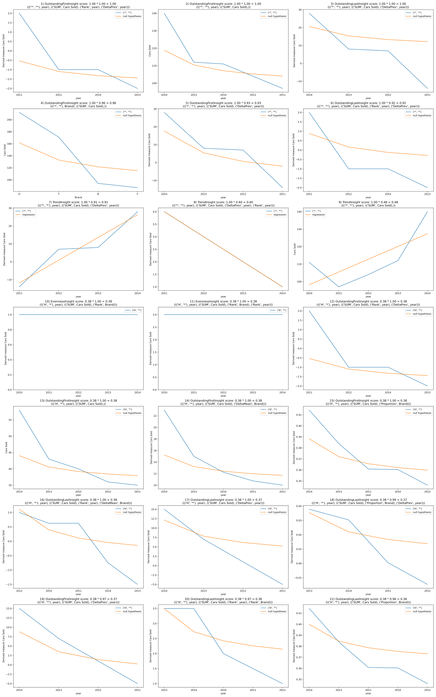

# Top-K Insights

Pandas based Python package to extract Top-K Insights from multi-dimensional data.

The package contains an implementation of the article 'Extracting Top-K Insights from Multi-dimensional Data' (2017) by Tang, B., Han, S., Yiu, M.L., Ding, R. and Zhang, D. and their subsequent work based on my Bachelor Thesis.

## Requirements

- Python3.8+

## Setup

````bash
python -m pip install git+https://github.com/Der-Henning/TopK-Insights
````

## Example

````Python
import pandas as pd
import matplotlib.pyplot as plt

from tki import TKI
from tki.insights import OutstandingFirstInsight, OutstandingLastInsight, \
    TrendInsight, EvennessInsight, CorrelationInsight
from tki.extractors import RankExtractor, DeltaPrevExtractor, \
    DeltaMeanExtractor, ProportionExtractor
from tki.aggregators import SumAggregator
from tki.dimensions import CardinalDimension, TemporalDimension, NominalDimension

data = [
    ['H', 2010, 40], ['T', 2010, 38], ['F', 2010, 13], ['B', 2010, 20],
    ['H', 2011, 35], ['T', 2011, 34], ['F', 2011, 10], ['B', 2011, 18],
    ['H', 2012, 36], ['T', 2012, 34], ['F', 2012, 14], ['B', 2012, 20],
    ['H', 2013, 43], ['T', 2013, 29], ['F', 2013, 23], ['B', 2013, 17],
    ['H', 2014, 58], ['T', 2014, 36], ['F', 2014, 27], ['B', 2014, 19]
]

extractors = {
    RankExtractor,
    DeltaPrevExtractor,
    DeltaMeanExtractor,
    ProportionExtractor
}
aggregators = {
    SumAggregator
}
insights = {
    OutstandingFirstInsight(),
    OutstandingLastInsight(),
    TrendInsight(),
    EvennessInsight(),
    CorrelationInsight()
}
tki = TKI(
    pd.DataFrame(data, columns=['Brand', 'year', 'Cars Sold']),
    dimensions=[
        NominalDimension('Brand'),
        TemporalDimension('year', date_format='%Y', freq='1Y')],
    measurements=[CardinalDimension('Cars Sold')],
    extractors=extractors,
    aggregators=aggregators,
    insights=insights,
    depth=3,
    result_size=21)
tki.run()

fig, axes = plt.subplots(7, 3, figsize=(25, 40), dpi=80)
for idx, i in enumerate(tki.heap.insights):
    plt.axes(axes[int(idx/3)][idx % 3])
    i.plot()
    plt.title(
        f"{idx + 1}) {type(i.insight).__name__} "
        f"score: {i.impact:.2f} * {i.significance:.2f} = {i.score:.2f}\n"
        f"{(i.sibling_group, i.composite_extractor)}")
    x_index = i.data.index.get_level_values(i.data.index.names[-1])
    plt.xticks(rotation=0)
    if isinstance(x_index, pd.DatetimeIndex):
        plt.xticks(
            range(i.data.index.size),
            x_index.to_series().dt.year)
fig.tight_layout()
plt.savefig('insights.svg')
tki.save('insights.pkl')
````

### Result



## User Interface

The App will provide a web based user interface for the tki package in the future.
At the moment it is possible to visualize saved insights in the browser.

Start the web server with

````bash
python -m tki.app
````

The project will be accessible via `http://127.0.0.1:8050/` in your web browser.
To display your previously generated results open the `Results` tab and upload your previously generated `insights.pkl` file.
